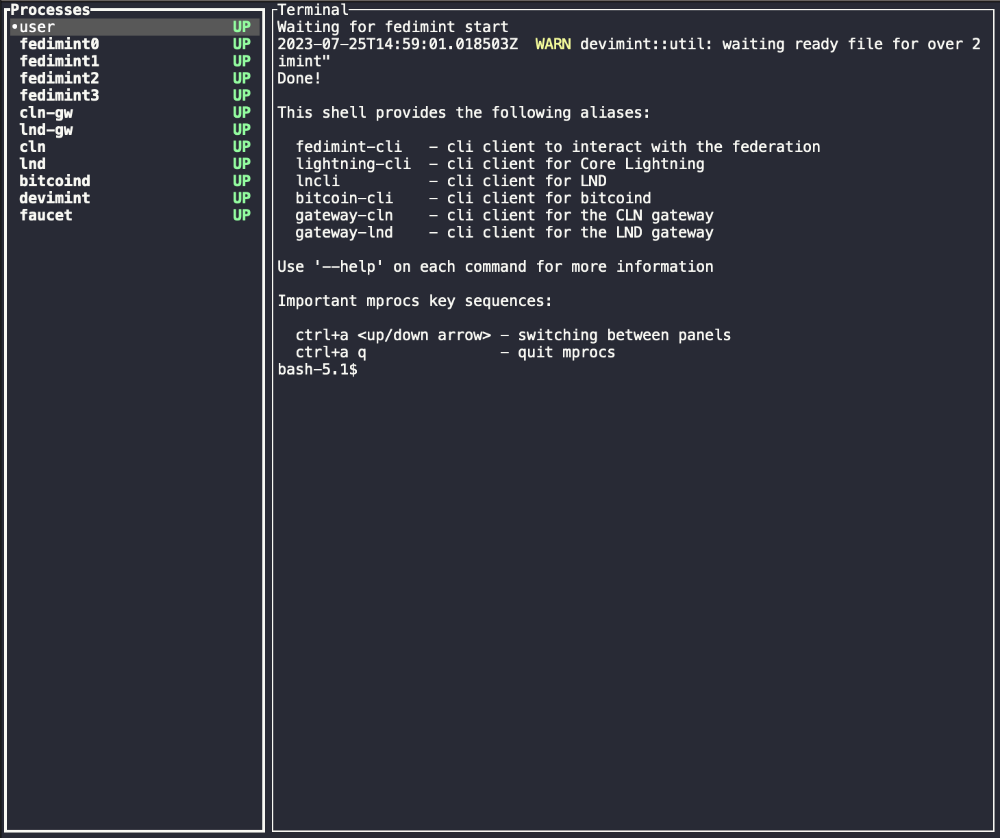

### Prerequisites

Fedimint's developer environment is build around the [Nix package manager](https://nixos.org). Once setup, you can execute one `nix develop` command to create a completely deterministic development, test and build environment with all required dependencies installed and pinned to exact versions. Detailed setup instructions are available in [dev-env.md](./dev-env.md).

Once you have cloned fedimint and can run `nix develop` as described in [dev-env.md](./dev-env.md), you're ready to setup a federation locally!

### Setting up the federation

The following command will setup a local environment for you to play around with fedimint.

```shell
just mprocs
```

This uses a tool called [mprocs](https://github.com/pvolok/mprocs) to spawn working local federation, displays logs for all daemons involved, as well as a shell with some convenient aliases and environment variables already setup so you can start tinkering. Click the tabs on the left nav to inspect the different processes. You can see available keyboard commands on the bottom -- for example, when you select text you'll see a `c` command that can be used to copy the text. To quit, type `ctrl-a` then `q` then `y`. If you're a tmux user, you can also use `just tmuxinator` to setup a tmux session with a running federation. But this is a little less user-friendly.



### Using the client

Note as you run commands the mint nodes will output logging information which you can adjust by setting the [RUST_LOG](https://docs.rs/env_logger/latest/env_logger/) env variable.

The previous step has already set up an e-cash client with a funded wallet for you.

You can view your client's holdings using the `info` command:

```shell
$ fedimint-cli info

{
  "federation_id": "b0d8dc13caff84c3e050a891c06966abfc55874b8173e3523eea323b827e6754270bb975b8693081b903a319c2d33591",
  "network": "regtest",
  "meta": {
    "federation_name": "Hals_trusty_mint"
  },
  "total_amount": 10000000,
  "total_num_notes": 52,
  "details": {
    "1": 2,
    "2": 3,
    ...
  }
}
```

The `spend` subcommand allows sending notes to another client. This will select the smallest possible set of the client's notes that represents a given amount.
The notes are base64 encoded into a note and printed as the `note` field.

```shell
$ fedimint-cli spend 100000

{
  "note": "BgAAAAAAAAAgAAAAAAAAAAEAAAAAAAAAwdt..."
}
```

The `validate` subcommand checks the validity of the signatures without claiming the notes. It does not check if the nonce is unspent. Validity will be printed as the `all_valid` boolean.

```shell
$ fedimint-cli validate BgAAAAAAAAAgAAAAAAAAAAEAAAAAAAAAwdt...

{
  "all_valid": true,
  "details": {
    "32": 1,
    "128": 1,
    "512": 1,
    ...
  }
}
```

A receiving client can now reissue these notes to claim them and avoid double spends:

```shell
$ fedimint-cli reissue BgAAAAAAAAAgAAAAAAAAAAEAAAAAAAAAwdt...

{
  "id": {
    "txid": "9b0ba12ae4295d4c393afee6a0ba7c9b0336ab6243a048265fd837a82a9c9059",
    "out_idx": 0
  }
}
```

### Using the Gateway

The [lightning gateway](../gateway/ln-gateway) connects the federation to the lightning network. It contains a federation client that holds ecash notes just like `fedimint-cli`. The mprocs setup scripts also give it some ecash. To check its balance, we use the [`gateway-cli`](../gateway/cli) utility. In the mprocs environment there are 2 lightning gateways -- one for Core Lightning and one for LND -- so we add `gateway-cln` and `gateway-lnd` shell aliases which will run `gateway-cli` pointed at that gateway. To get the balance with the Core Lightinng gateway, run `gateway-cln info`, copy the federation id and then:

```shell
$ gateway-cln balance --federation-id <FEDERATION-ID>

{
  30000000
}
```

Mprocs has 2 lightning nodes running. [Core Lightning](https://github.com/ElementsProject/lightning) which is running a gateway, and [LND](https://github.com/lightningnetwork/lnd) which represents an external node that doesn't know about Fedimint. With these two nodes, you can simulate sending into and out of Fedimint via Lightning.

To make an outgoing payment we generate a Lightning invoice from LND, our non-gateway lightning node:

```shell
$ lncli addinvoice --amt_msat 100000

{
   ...
   "r_hash": "1072fe19b3a53b3d778f6d5b0b...",
   "payment_request": "lnbcrt1u1p3vdl3ds...",
   ...
}
```

Pay the invoice by copying the `payment_request` field:

```shell
$ fedimint-cli ln-pay "lnbcrt1u1p3vdl3ds..."
```

Confirm the invoice was paid, copy the `r_hash` field from the `lncli addinvoice` command above:

```shell
$ lncli lookupinvoice 1072fe19b3a53b3d778f6d5b0b...

{
    ...
    "state": "SETTLED",
    ...
}
```

To receive a lightning payment inside use `fedimint-cli` to create an invoice:
```shell
$ fedimint-cli ln-invoice --amount 1000

{
  "invoice": "lnbcrt10n1pjq2zwxdqjv...",
  "operation_id": "5b37007b6a1fcb74e71631dcdb9d96504...."
}
```

Have `lncli` pay it:

```shell
$ lncli payinvoice --force lnbcrt10n1pjq2zwxdqjv...
```

Have mint client check that payment succeeded and display new balances:

```shell
$ fedimint-cli wait-invoice "5b37007b6a1fcb74e71631dcdb9d96504...."
$ fedimint-cli info
```

Read [more about the Gateway here](./gateway.md)

### Other options

There also exist some other, more experimental commands that can be explored using the `--help` flag:

```shell
$ fedimint-cli help
Usage: fedimint-cli [OPTIONS] <COMMAND>

Commands:
  version-hash     Print the latest git commit hash this bin. was build with
  info             Display wallet info (holdings, tiers)
  reissue          Reissue notes received from a third party to avoid double spends
  spend            Prepare notes to send to a third party as a payment
  ln-invoice       Create a lightning invoice to receive payment via gateway
  wait-invoice     Wait for incoming invoice to be paid
  ln-pay           Pay a lightning invoice via a gateway
  list-gateways    List registered gateways
  switch-gateway   Switch active gateway
  deposit-address  Generate a new deposit address, funds sent to it can later be claimed
  await-deposit    Wait for deposit on previously generated address
  withdraw         Withdraw funds from the federation
  backup           Upload the (encrypted) snapshot of mint notes to federation
  restore          Restore the previously created backup of mint notes (with `backup` command)
  print-secret     Print the secret key of the client
  admin
  dev
  join-federation  Join a federation using it's InviteCode
  completion
  help             Print this message or the help of the given subcommand(s)

Options:
      --data-dir <WORKDIR>   The working directory of the client containing the config and db [env: FM_DATA_DIR=]
      --our-id <OUR_ID>      Peer id of the guardian [env: FM_OUR_ID=]
      --password <PASSWORD>  Guardian password for authentication [env: FM_PASSWORD=]
  -h, --help                 Print help
  -V, --version              Print version
```
